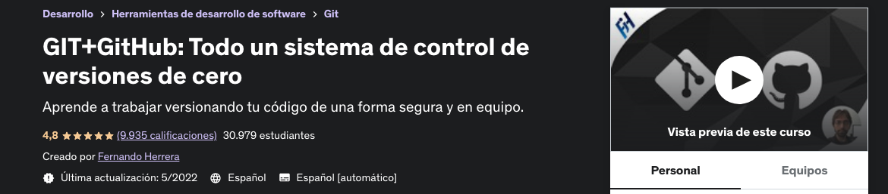

# github
All about Git and Github

## Starting 31/10/2022 With te course: GIT+GitHub: Todo un sistema de control de versiones de cero

https://www.udemy.com/course/git-github/

## La organización del curso va profundizando en los temas de la siguiente manera:

* Fundamentos de Git   
* Temas un poco más complejos y útiles de Git   
* Control del repositorio local y remoto   
* Viajes en el tiempo
* Recuperación en caso de perdida del proyecto
* Ramas, stash, rebase
* Gentil introducción a GitHub   
* Temas básicos y avanzados de GitHub   
* Trabajo en equipo     
* Teams y sus restricciones   
* Organizaciones   
* Gists   

## [Tutorial de Markdown:](https://www.markdowntutorial.com/)
## [GitHub Markdown sheet](https://guides.github.com/pdfs/markdown-cheatsheet-online.pdf)
## [Emojis de GitHub](https://www.webfx.com/tools/emoji-cheat-sheet/)
